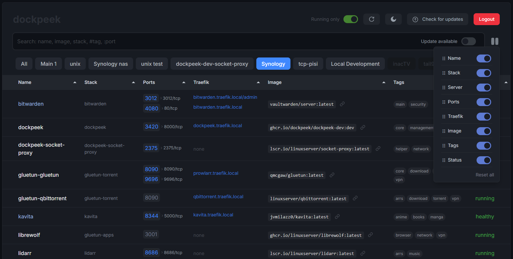

<div align="center">
  
  <a href="https://github.com/dockpeek/dockpeek">
     
  </a>
  <h1>Dockpeek</h1>
  
  [](https://github.com/dockpeek/dockpeek/releases)
  [](https://github.com/dockpeek/dockpeek)
  [](https://github.com/dockpeek/dockpeek/pkgs/container/dockpeek)
  [](https://github.com/dockpeek/dockpeek/issues)
  [](https://github.com/dockpeek/dockpeek/commits)
  [](https://github.com/dockpeek/dockpeek/blob/main/LICENSE)
  [](https://hub.docker.com/r/dockpeek/dockpeek)

<h3>Quick Access & One-Click Updates for Your Docker Containers</h3>

<p><b>Dockpeek</b> is a lightweight, self-hosted Docker dashboard built for speed and simplicity.  
Instantly access your container web interfaces, monitor ports, and apply updates with a single click.  
Automatically reads Traefik labels to display container addresses, keeping your setup organized — all from one clean, intuitive interface.</p>
</div>

  
## ✨ Key Features

- **Port Mapping Overview** — See all running containers and their published ports at a glance
- **One-Click Access** — Open containerized web apps instantly with direct links
- **Traefik Integration** — Auto-detect and display container addresses from Traefik labels
- **Multi-Host Management** — Manage multiple Docker hosts from one dashboard
- **Zero Configuration** — Works out of the box, auto-detecting containers
- **Update Management** — Check for image updates and install with a single click
- **Responsive UI** — Optimized for desktops, tablets, and smartphones

### Labels Support

Enhance control with custom labels:

- `dockpeek.https` — Force HTTPS protocol for specific ports
- `dockpeek.link` — Make container names clickable links
- `dockpeek.ports` — Add custom ports to display alongside detected ports
- `dockpeek.tags` — Organize and categorize containers with custom tags

<br>

<div align="center">
  


</div>

<br>

## 🔧 Installation

### Basic Setup (Recommended)

The easiest way to get started with Dockpeek:

```yaml
services:
  dockpeek:
    image: ghcr.io/dockpeek/dockpeek:latest
    container_name: dockpeek
    environment:
      - SECRET_KEY=your_secure_secret_key # Required: Set a secure secret key
      - USERNAME=admin # username
      - PASSWORD=secure_password # password
    ports:
      - "3420:8000"
    volumes:
      - /var/run/docker.sock:/var/run/docker.sock
    restart: unless-stopped
```

**Then visit:** http://localhost:3420

### Option 2: Secure Setup with Socket Proxy

For enhanced security, use a socket proxy to limit Docker API access:

```yaml
services:
  dockpeek:
    image: ghcr.io/dockpeek/dockpeek:latest
    container_name: dockpeek
    environment:
      - SECRET_KEY=your_secure_secret_key
      - USERNAME=admin
      - PASSWORD=secure_password
      - DOCKER_HOST=tcp://socket-proxy:2375 # Connect via socket proxy
    ports:
      - "3420:8000"
    depends_on:
      - socket-proxy
    restart: unless-stopped

  socket-proxy:
    image: lscr.io/linuxserver/socket-proxy:latest
    container_name: dockpeek-socket-proxy
    environment:
      - CONTAINERS=1
      - IMAGES=1
      - PING=1
      - VERSION=1
      - INFO=1
      - POST=1
      # Required for container updates
      - ALLOW_START=1
      - ALLOW_STOP=1
      - ALLOW_RESTARTS=1
      - NETWORKS=1
    volumes:
      - /var/run/docker.sock:/var/run/docker.sock
    read_only: true
    tmpfs:
      - /run
    restart: unless-stopped
```

<br>

## 🌐 Multi-Host Setup

Manage multiple Docker hosts from a single dashboard:

```yaml
services:
  dockpeek:
    image: ghcr.io/dockpeek/dockpeek:latest
    container_name: dockpeek
    restart: unless-stopped
    ports:
      - "3420:8000"
    environment:
      - SECRET_KEY=your_secure_secret_key
      - USERNAME=admin
      - PASSWORD=secure_password

      # --- Docker Host 1 (Local) ---
      - DOCKER_HOST_1_URL=unix:///var/run/docker.sock # Local Docker socket
      - DOCKER_HOST_1_NAME=Local Development # Display name in UI
      # DOCKER_HOST_1_PUBLIC_HOSTNAME is optional; uses host IP by default

      # --- Docker Host 2 (Remote Server) ---
      - DOCKER_HOST_2_URL=tcp://192.168.1.100:2375 # Remote socket proxy
      - DOCKER_HOST_2_NAME=Production Server # Display name in UI
      - DOCKER_HOST_2_PUBLIC_HOSTNAME=server.local # Optional: Custom hostname for links

      # --- Docker Host 3 (Tailscale) ---
      - DOCKER_HOST_3_URL=tcp://100.64.1.5:2375 # Tailscale IP
      - DOCKER_HOST_3_NAME=Remote VPS # Display name in UI
      - DOCKER_HOST_3_PUBLIC_HOSTNAME=vps.tailnet.ts.net # Optional: Tailscale FQDN

      # --- Continue pattern for additional hosts (4, 5, etc.) ---
    volumes:
      # Required only if you are connecting to a local socket
      - /var/run/docker.sock:/var/run/docker.sock:ro
```

> [!TIP]
> Install a Docker Socket Proxy on each remote host for secure API access.

<br>

## ⚙️ Configuration

### Required Environment Variables

| Variable     | Description                                                                |
| ------------ | -------------------------------------------------------------------------- |
| `SECRET_KEY` | **Required.** Essential for application functionality and session security |
| `USERNAME`   | **Required.** Username for dashboard login                                 |
| `PASSWORD`   | **Required.** Password for dashboard login                                 |

### Optional Configuration

| Variable                      | Default       | Description                                            |
| ----------------------------- | ------------- | ------------------------------------------------------ |
| `DISABLE_AUTH`                | `false`       | Set to `true` to disable authentication                |
| `TRAEFIK_LABELS`              | `true`        | Show Traefik integration column                        |
| `TAGS`                        | `true`        | Enable container tagging feature                       |
| `DOCKER_HOST`                 | Local socket  | Primary Docker connection URL                          |
| `DOCKER_HOST_NAME`            | `default`     | Display name for the primary server in the UI          |
| `DOCKER_HOST_PUBLIC_HOSTNAME` | Auto-detected | Optional hostname or IP for generating clickable links |

### Multi-Host Variables

For additional Docker hosts, use the pattern `DOCKER_HOST_N_*`:

| Variable                        | Description                              |
| ------------------------------- | ---------------------------------------- |
| `DOCKER_HOST_N_URL`             | Docker API URL (e.g., `tcp://host:2375`) |
| `DOCKER_HOST_N_NAME`            | Display name in the dashboard            |
| `DOCKER_HOST_N_PUBLIC_HOSTNAME` | Optional public hostname for links       |

> [!IMPORTANT] > **Important Configuration Requirements:**
>
> - `SECRET_KEY` must always be set - dockpeek will not function without it
> - `USERNAME` and `PASSWORD` are required unless `DISABLE_AUTH=true`
> - Multi-host variables require matching `N` identifiers (URL, name, hostname)

<br>

## 🏷️ Container Labels

Customize how containers appear and behave in Dockpeek:

```yaml
services:
  webapp:
    image: nginx:latest
    ports:
      - "3001:80"
    labels:
      - "dockpeek.ports=8080,9090" # Show additional ports
      - "dockpeek.https=3001,8080" # Force HTTPS for these ports
      - "dockpeek.link=https://myapp.local" # Make container name clickable
      - "dockpeek.tags=frontend,production" # Add organization tags
```

### Available Labels

| Label            | Purpose               | Example                         |
| ---------------- | --------------------- | ------------------------------- |
| `dockpeek.ports` | Show additional ports | `dockpeek.ports=8080,9090`      |
| `dockpeek.https` | Force HTTPS for ports | `dockpeek.https=9002,3000`      |
| `dockpeek.link`  | Custom container link | `dockpeek.link=https://app.com` |
| `dockpeek.tags`  | Organization tags     | `dockpeek.tags=web,prod`        |

<br>

## 🐳 Docker Swarm Support

Dockpeek natively supports Docker Swarm, You can deploy Dockpeek as a stack, with a single socket-proxy instance, and view/manage all Swarm services and tasks in the dashboard. This configuration is ideal for production clusters using Traefik as an ingress proxy.


<details>
<summary>Click to see Example stack file (docker-compose-swarm-socket.yml)</summary>

```yaml
services:
  dockpeek:
    image: ghcr.io/dockpeek/dockpeek:latest
    environment:
      - SECRET_KEY=your_secure_secret_key
      - USERNAME=admin
      - PASSWORD=secure_password
      - TRAEFIK_LABELS=true
      - DOCKER_HOST=tcp://tasks.socket-proxy:2375 # Connect to Swarm manager via socket-proxy
    ports:
      - "3420:8000"
    networks:
      - traefik
      - dockpeek-internal
    deploy:
      replicas: 1
      labels:
        - "traefik.enable=true"
        - "traefik.http.routers.dockpeek.rule=Host(`dockpeek.example.com`)"
        - "traefik.http.routers.dockpeek.entrypoints=websecure"
        - "traefik.http.routers.dockpeek.tls=true"
        - "traefik.http.services.dockpeek.loadbalancer.server.port=8000"

  socket-proxy:
    image: lscr.io/linuxserver/socket-proxy:latest
    environment:
      - CONTAINERS=1
      - IMAGES=1
      - PING=1
      - VERSION=1
      - INFO=1
      - POST=1
      - SERVICES=1 # Enable Swarm services API
      - TASKS=1 # Enable Swarm tasks API
      - NODES=1 # Enable Swarm nodes API
    volumes:
      - /var/run/docker.sock:/var/run/docker.sock:ro
      - type: tmpfs
        target: /run
        tmpfs:
          size: 100000000
    networks:
      - socket-proxy
    deploy:
      replicas: 1
      placement:
        constraints:
          - node.role == manager

networks:
  socket-proxy:
  traefik:
    external: true
```

**How it works:**

- The dockpeek and socket-proxy services share a private network for secure API access.
- The traefik network is external and should be pre-created by your Traefik deployment.
- Traefik labels on dockpeek expose the dashboard securely at your chosen domain.
- The DOCKER_HOST variable points to the socket-proxy service, which must run on a Swarm manager node.
- Dockpeek will auto-detect Swarm mode and show all services/tasks in the dashboard, with all the usual features (port mapping, Traefik integration, update checks, etc.).

> Deploy with:
>
> ```sh
> docker stack deploy -c docker-compose-swarm-socket.yml dockpeek
> ```

</details>

<br>

## Frequently Asked Questions

Here are some common questions about using Dockpeek.

<br>

<details>
<summary><strong>How do I search for containers by port?</strong></summary>

> Use the format `:port` in the search box. For example, typing `:8080` will show all containers exposing port 8080.

</details>

<details>
<summary><strong>When does Dockpeek use HTTPS automatically?</strong></summary>

> Dockpeek automatically uses HTTPS for:
>
> - Container port `443/tcp`
> - Host ports ending with `443` (e.g., `8443`, `9443`)
> - Ports specified with the `dockpeek.https` label

</details>

<details>
<summary><strong>How do I make container names clickable?</strong></summary>

> Use the `dockpeek.link` label:
>
> ```yaml
> labels:
>   - "dockpeek.link=https://myapp.example.com"
> ```
>
> This is especially useful with reverse proxies to link directly to public addresses.

</details>

<details>
<summary><strong>How do I show ports for containers without port mapping?</strong></summary>

> Some containers (like those using host networking or behind reverse proxies) don't expose ports through Docker's standard port mapping. Use the `dockpeek.ports` label:
>
> ```yaml
> labels:
>   - "dockpeek.ports=8096,8920"
> ```

</details>

<details>
<summary><strong>How do I clear the search filter?</strong></summary>

> Click on the "Dockpeek" logo/title at the top of the page to reset the search and return to the full container view.

</details>

<details>
<summary><strong>What permissions does Dockpeek need for updates?</strong></summary>

> To install container updates, Dockpeek needs:
>
> **For direct Docker socket access:**
>
> - Read/write access to `/var/run/docker.sock`
>
> **For socket-proxy setups, ensure these permissions are enabled:**
>
> ```yaml
> environment:
>   - POST=1 # Required for API write operations
>   - ALLOW_START=1 # Start containers after update
>   - ALLOW_STOP=1 # Stop containers for update
>   - ALLOW_RESTARTS=1 # Restart containers if needed
>   - NETWORKS=1 # Connect containers to networks
> ```
>
> The update feature works with all supported connection methods (local socket, remote socket-proxy, and multi-host configurations).

</details>

<br>

---

<div align="center">
  <p>Made with ❤️ for the self-hosted & open-source community</p>
  <p>
    <a href="https://github.com/dockpeek/dockpeek/issues">Report Bug</a> •
    <a href="https://github.com/dockpeek/dockpeek/releases">View Releases</a>
  </p>
</div>
