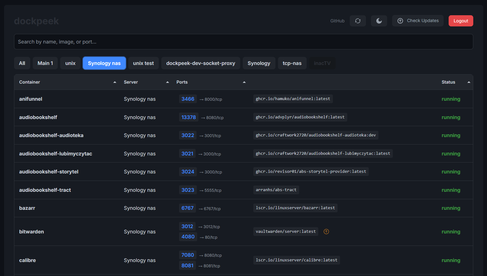

<p align="center">
  <a href="https://github.com/dockpeek/dockpeek">
    
  </a>
</p>

# **Dockpeek** — Port Mapping Dashboard

**Dockpeek** is a lightweight dashboard to quickly view Docker container port mappings. Supports multiple Docker sockets and instant opening of exposed ports for easy access to your containerized apps.

## Key Features

- **Port Mapping** — Clickable host-to-container port links for instant web app access.  
- **Multi Docker Sockets** — Manage multiple Docker sockets in one place.  
- **Secure by Design** — Authentication and socket-proxy for secure, read-only Docker API access.  
- **Effortless Search** — Find containers by name or external port.  
- **Data Export** — Export container and port details as JSON.  
- **User-Friendly UI** — Clean design with persistent dark mode.

## Screenshots

<p align="left">
  
</p>

## Why Use Dockpeek?

In complex setups with multiple Docker hosts or many containers, tracking which app uses which port can be tough. **Dockpeek** makes it easy by offering a centralized, secure, and user-friendly interface to view all port mappings at a glance.

## Getting Started

### Option 1: Direct Access
```yaml
services:
  dockpeek:
    image: ghcr.io/dockpeek/dockpeek:latest
    container_name: dockpeek
    environment:
      - SECRET_KEY=my_secret_key   # Set secret key
      - USERNAME=admin             # Change default username
      - PASSWORD=admin             # Change default password
    ports:
      - "3420:8000"
    volumes:
      - /var/run/docker.sock:/var/run/docker.sock
    restart: unless-stopped
```

### Option 2 : Through `socket-proxy`


```yaml
services:
  dockpeek:
    image: ghcr.io/dockpeek/dockpeek:latest
    container_name: dockpeek
    environment:
      - SECRET_KEY=my_secret_key   # Set secret key
      - USERNAME=admin             # Change default username
      - PASSWORD=admin             # Change default password
      - DOCKER_HOST=tcp://dockpeek-socket-proxy:2375
    ports:
      - "3420:8000"
    depends_on:
      - dockpeek-socket-proxy
    restart: unless-stopped

  dockpeek-socket-proxy:
    image: lscr.io/linuxserver/socket-proxy:latest
    container_name: dockpeek-socket-proxy
    environment:
      - CONTAINERS=1
      - IMAGES=1
      - PING=1
      - VERSION=1
      - LOG_LEVEL=info
    volumes:
      - /var/run/docker.sock:/var/run/docker.sock:ro
    read_only: true
    tmpfs:
      - /run
    ports:
      - "2375:2375"
    restart: unless-stopped
```

### Additional Docker Sockets
```yaml
    environment:
      - SECRET_KEY=my_secret_key   # Set secret key
      - USERNAME=admin             # Change default username
      - PASSWORD=admin             # Change default password

      # Optional: Configure additional Docker hosts by adjusting the following.
      # Each host requires a matching set of DOCKER_HOST_N_URL, DOCKER_HOST_N_NAME, and optionally DOCKER_HOST_N_PUBLIC_HOSTNAME.
      
      # Docker Host 1
      - DOCKER_HOST_1_URL=unix:///var/run/docker.sock    # Required for DOCKER_HOST_N: URL of the additional Docker host.
      - DOCKER_HOST_1_NAME=MyServer1                     # Required for DOCKER_HOST_N: Display name shown in the UI.
      - DOCKER_HOST_1_PUBLIC_HOSTNAME=                   # Optional: Public hostname or IP for clickable links. If empty, inferred from the URL.

      # Docker Host 1
      - DOCKER_HOST_2_URL=tcp://192.168.1.168:2375       # Required for DOCKER_HOST_N: URL of the additional Docker proxy.
      - DOCKER_HOST_2_NAME=Synology                      # Required for DOCKER_HOST_N: Display name shown in the UI.
      - DOCKER_HOST_2_PUBLIC_HOSTNAME=NAS                # Optional: Public hostname or IP for clickable links. If empty, inferred from the URL. 
                                                         # Example: Use device name like 'NAS' for easier access via Tailscale.                         

      # Add more Docker hosts as needed, incrementing N accordingly.

```
   `unix:///var/run/docker.sock`   Requires mounting the Docker socket `volumes: /var/run/docker.sock:/var/run/docker.sock`


  ## Environment

DockPeek is configured entirely through environment variables. These allow flexible deployment across varying host setups and security requirements.
| Variable                        | Required | Description                                                                                                              |
| ------------------------------- | -------- | ------------------------------------------------------------------------------------------------------------------------ |
| `SECRET_KEY`                    | Yes      | A strong, unique secret used to secure session data and cookie encryption.                                               |
| `USERNAME`                      | Yes      | Username used to authenticate into the DockPeek dashboard.                                                               |
| `PASSWORD`                      | Yes      | Corresponding password for the user account.                                                                             |
| `DOCKER_HOST`                   | No       | URL of the primary Docker socket (e.g., `unix:///var/run/docker.sock` or `tcp://socket-proxy:2375`). Defaults to local socket if omitted. Recommended for use with a local proxy                |
| `DOCKER_HOST_N_URL`             | No       | Defines an additional Docker host (e.g., `tcp://192.168.1.10:2375`). Replace `N` with a number (`1`, `2`, `3`, ...).     |
| `DOCKER_HOST_N_NAME`            | No       | Friendly name for display in the UI, associated with the corresponding `DOCKER_HOST_N_URL`.                              |
| `DOCKER_HOST_N_PUBLIC_HOSTNAME` | No       | Optional public hostname or IP used for generating clickable container links. If unset, it's inferred from the host URL. |

> **Note:** All multi-host variables (`DOCKER_HOST_N_*`) must use matching `N` indices for URL, name, and hostname entries.
