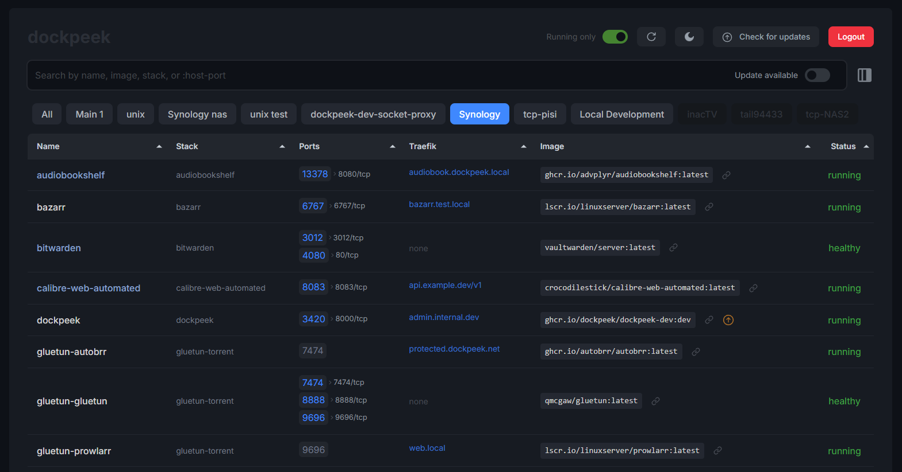

<div align="center">
  <a href="https://github.com/dockpeek/dockpeek">
     
  </a>
</div>

<h1 align="center">Dockpeek</h1>
<h3 align="center">Docker Port Dashboard for Easy Container Access</h3>

<br>
<br>

**Dockpeek** is a lightweight, self-hosted Docker dashboard that provides instant visibility and access to your containerized services through a clean, intuitive interface. Supporting both local Docker sockets and remote hosts via `socket-proxy`, it simplifies management of multiple Docker environments from a single centralized location.

All exposed ports are displayed in an organized table with one-click access, including automatically detected addresses from Traefik labels. Dockpeek also features **image update monitoring** to alert you when newer versions of your container images become available, helping keep your infrastructure current and secure.


## Key Features

- **Port Mapping Overview** – View all running containers and their published ports at a glance
- **Traefik Integration** – Dedicated column displaying container addresses from Traefik labels
- **One-Click Access** – Launch containerized web applications instantly with direct URL links
- **Multi-Host Management** – Monitor multiple Docker hosts and sockets from a unified dashboard
- **Zero Configuration** – Automatic container detection with no setup required
- **Image Update Monitoring** – Stay informed about available updates for your container images
- **Smart Label Support** – Enhanced control with custom labels:
  - `dockpeek.https` – Force HTTPS protocol for specific ports
  - `dockpeek.link` – Make container names clickable links
  - `dockpeek.ports` – Add custom ports to display alongside detected ports
  - `dockpeek.tags` – Organize and categorize containers with custom tags
- **Mobile-Responsive** – Full functionality across smartphones, tablets, and desktop devices


<br>

<div align="center">



</div>

<br>

## Why Use Dockpeek?

**Tired of juggling IP addresses and port numbers to access your containerized applications?** Dockpeek delivers a clean, centralized dashboard that provides one-click access to any exposed container service—whether running locally or on remote hosts.

Perfect for managing multiple containers across different machines, Dockpeek helps you stay organized by tracking available image updates and displaying Traefik-managed addresses in a dedicated view. Keep your containerized environment simple, accessible, and current with minimal effort.


<br>


## 🔧 Installation

### Option 1: Direct Socket Access

```yaml
services:
  dockpeek:
    image: ghcr.io/dockpeek/dockpeek:latest
    container_name: dockpeek
    environment:
      - SECRET_KEY=your_secure_secret_key    # Required: Set a secure secret key
      - USERNAME=admin                       # Required: Change default username
      - PASSWORD=secure_password             # Required: Change default password
    ports:
      - "3420:8000"
    volumes:
      - /var/run/docker.sock:/var/run/docker.sock
    restart: unless-stopped
```

### Option 2: Using Socket Proxy

```yaml
services:
  dockpeek:
    image: ghcr.io/dockpeek/dockpeek:latest
    container_name: dockpeek
    environment:
      - SECRET_KEY=your_secure_secret_key    # Required: Set a secure secret key
      - USERNAME=admin                       # Required: Change default username  
      - PASSWORD=secure_password             # Required: Change default password
      - DOCKER_HOST=tcp://socket-proxy:2375  # Connect via socket proxy
    ports:
      - "3420:8000"
    depends_on:
      - socket-proxy
    restart: unless-stopped

  socket-proxy:
    image: lscr.io/linuxserver/socket-proxy:latest
    container_name: dockpeek-socket-proxy
    environment:
      - CONTAINERS=1 
      - IMAGES=1     
      - PING=1       
      - VERSION=1    
      - INFO=1       
      - POST=1       
    volumes:
      - /var/run/docker.sock:/var/run/docker.sock:ro
    read_only: true
    tmpfs:
      - /run
    ports:
      - "2375:2375"
    restart: unless-stopped
```

### Option 3: Docker Swarm/Stack Deployment (with Traefik)

Dockpeek now supports native Docker Swarm mode! You can deploy Dockpeek as a stack, with a single socket-proxy instance, and view/manage all Swarm services and tasks in the dashboard. This is ideal for production clusters using Traefik as an ingress proxy.

**Example stack file (docker-compose-swarm-socket.yml):**

```yaml
services:
  dockpeek:
    image: ghcr.io/dockpeek/dockpeek:latest
    environment:
      - SECRET_KEY=your_secure_secret_key
      - USERNAME=admin
      - PASSWORD=secure_password
      - TRAEFIK_LABELS=true
      - DOCKER_HOST=tcp://tasks.socket-proxy:2375  # Connect to Swarm manager via socket-proxy
    ports:
      - "3420:8000"
    networks:
      - traefik
      - dockpeek-internal
    deploy:
      replicas: 1
      labels:
        - "traefik.enable=true"
        - "traefik.http.routers.dockpeek.rule=Host(`dockpeek.example.com`)"
        - "traefik.http.routers.dockpeek.entrypoints=websecure"
        - "traefik.http.routers.dockpeek.tls=true"
        - "traefik.http.services.dockpeek.loadbalancer.server.port=8000"

  socket-proxy:
    image: lscr.io/linuxserver/socket-proxy:latest
    environment:
      - CONTAINERS=1
      - IMAGES=1
      - PING=1
      - VERSION=1
      - INFO=1
      - POST=1
      - SERVICES=1     # Enable Swarm services API
      - TASKS=1        # Enable Swarm tasks API
      - NODES=1        # Enable Swarm nodes API
    volumes:
      - /var/run/docker.sock:/var/run/docker.sock:ro
      - type: tmpfs
        target: /run
        tmpfs:
          size: 100000000
    networks:
      - socket-proxy
    deploy:
      replicas: 1
      placement:
        constraints:
          - node.role == manager

networks:
  socket-proxy:
  traefik:
    external: true
```

**How it works:**

- The dockpeek and socket-proxy services share a private network for secure API access.
- The traefik network is external and should be pre-created by your Traefik deployment.
- Traefik labels on dockpeek expose the dashboard securely at your chosen domain.
- The DOCKER_HOST variable points to the socket-proxy service, which must run on a Swarm manager node.
- Dockpeek will auto-detect Swarm mode and show all services/tasks in the dashboard, with all the usual features (port mapping, Traefik integration, update checks, etc.).

> Deploy with:
> ```sh
> docker stack deploy -c docker-compose-swarm-socket.yml dockpeek
> ```

<br>

### Adding Multiple Docker Hosts

Connect and manage multiple Docker instances from a single centralized dashboard.

> [!TIP]
> The recommended approach is installing a Docker Socket Proxy on each remote host. This securely exposes the Docker API via HTTP (typically port 2375), enabling controlled remote access to each Docker instance.

Configure additional hosts using environment variables:

```yaml
    environment:
      # Add multiple Docker hosts using numbered environment variables

      # Docker Host 1 (Local)
      - DOCKER_HOST_1_URL=unix:///var/run/docker.sock      # Local Docker socket
      - DOCKER_HOST_1_NAME=Local Development               # Display name in UI
      # DOCKER_HOST_1_PUBLIC_HOSTNAME not needed - will use container's host IP

      # Docker Host 2 (Remote Server)
      - DOCKER_HOST_2_URL=tcp://192.168.1.100:2375        # Remote socket proxy
      - DOCKER_HOST_2_NAME=Production Server               # Display name in UI  
      - DOCKER_HOST_2_PUBLIC_HOSTNAME=server.local         # Optional: Local network hostname

      # Docker Host 3 (Tailscale)
      - DOCKER_HOST_3_URL=tcp://100.64.1.5:2375           # Tailscale IP
      - DOCKER_HOST_3_NAME=Remote VPS                      # Display name in UI
      - DOCKER_HOST_3_PUBLIC_HOSTNAME=vps.tailnet.ts.net   # Optional: Tailscale hostname

      # Continue pattern for additional hosts (4, 5, etc.)
```

> [!IMPORTANT]
> When using `unix:///var/run/docker.sock`, ensure the Docker socket is mounted:
> ```yaml
> volumes:
>   - /var/run/docker.sock:/var/run/docker.sock
> ```
> - `PUBLIC_HOSTNAME` replaces only the hostname in URLs while preserving ports (useful for Tailscale, local DNS, or IP-to-hostname mapping)


<br>


## Environment Variables

### Core Configuration
| Variable                      | Description                                                                 |
|-------------------------------|-----------------------------------------------------------------------------|
| `SECRET_KEY`                  | **Required.** Strong, unique secret key for session security.              |
| `USERNAME`                    | **Required.** Username for dashboard authentication.                       |
| `PASSWORD`                    | **Required.** Password for dashboard authentication.                       |
| `DOCKER_HOST`                 | Primary Docker socket URL:<br>• Local: `unix:///var/run/docker.sock`<br>• Remote: `tcp://hostname:2375` |
| `DOCKER_HOST_NAME`            | Display name for primary host in UI (default: `local`).                    |
| `DOCKER_HOST_PUBLIC_HOSTNAME` | Public hostname/IP for generating clickable links (optional).              |
| `TRAEFIK_LABELS`              | Enable Traefik integration column (`true`/`false`, default: `true`).       |
| `TAGS`                        | Enable container tagging functionality (`true`/`false`, default: `true`). |

### Multi-Host Configuration
| Variable                        | Description                                                               |
|---------------------------------|---------------------------------------------------------------------------|
| `DOCKER_HOST_N_URL`             | URL for additional Docker hosts (e.g., `tcp://192.168.1.100:2375`).<br>Must be directly reachable; `host.docker.internal` not supported.<br>`N` = numeric identifier (1, 2, 3, etc.). |
| `DOCKER_HOST_N_NAME`            | Display name for host `N` in the dashboard UI.                           |
| `DOCKER_HOST_N_PUBLIC_HOSTNAME` | Public hostname/IP for host `N` clickable links (optional).<br>If unset, automatically inferred from `DOCKER_HOST_N_URL`. |

> [!IMPORTANT]
> **Configuration Requirements:**
> - `SECRET_KEY` and `PASSWORD` must be set for security
> - Multi-host variables require matching `N` identifiers (URL, name, hostname)
> - Remote hosts must be directly accessible; Docker internal networking won't work
> - Ensure socket proxy is running on remote hosts when using TCP connections

<br>


## Labels

Dockpeek supports custom labels to control behavior for individual containers. Add these labels to the `labels` section of your `docker-compose.yml` or Docker run commands.

| Label                        | Description                                                                 |
|-------------------------------|-----------------------------------------------------------------------------|
| `dockpeek.ports=PORTS`        | **Additional ports** to display beyond those automatically detected.<br/>Comma-separated list of ports. Essential for `--net=host` containers or services behind reverse proxies.<br/>Example: `dockpeek.ports=8080,9090` |
| `dockpeek.https=PORTS`        | **Force HTTPS protocol** for specified ports instead of HTTP.<br/>Comma-separated list of ports that require secure connections.<br/>Example: `dockpeek.https=9002,3000` |
| `dockpeek.link=URL`           | **Custom container link** - makes the container name clickable.<br/>Redirects to the specified URL when container name is clicked.<br/>Example: `dockpeek.link=https://app.example.com` |
| `dockpeek.tags=TAGS`          | **Container tags** for organization and categorization.<br/>Comma-separated list of custom tags to help organize containers in the dashboard.<br/>Example: `dockpeek.tags=production,web,critical` |

### Usage Example

```yaml
services:
  webapp:
    image: nginx:latest
    ports:
      - "3001:80"
    labels:
      - "dockpeek.ports=8080"                    # Show additional port 8080
      - "dockpeek.https=3001,8080"               # Force HTTPS for custom ports
      - "dockpeek.link=https://myapp.local"      # Make container name clickable
```

<br>

## FAQ

**Q: Can I search for containers by host port only? (left one)**

Yes. Dockpeek supports searching using `:port`.

> For example, typing `:8080` will show all containers exposing port `8080`.

<br>

**Q: How does Dockpeek determine when to use HTTPS?**

Dockpeek automatically uses HTTPS for:

* Container port `443/tcp`
* Host ports ending with `443` (e.g., `8443`, `9443`)
* Ports specified with the `dockpeek.https` label

> Add the label to containers where these ports are exposed:
```yaml
labels:
  - "dockpeek.https=3001,3002"
```

<br>

**Q: Can I make container names clickable?**

Yes, use the `dockpeek.link` label to create custom links:

> Particularly useful with reverse proxies to link directly to public addresses:
```yaml
labels:
  - "dockpeek.link=https://myapp.example.com"
```


<br>

**Q: How can I organize containers with tags?**

Use the `dockpeek.tags` label to categorize and organize your containers:

> Add tags to your containers for better organization:
```yaml
labels:
  - "dockpeek.tags=production,web,critical"
```

<br>

**Q: How to add ports for containers without port mapping? (e.g. host networking, reverse proxy)**

Some containers don't expose ports through Docker's standard port mapping.

> **Solution:** Manually specify ports using labels:
```yaml
labels:
  - "dockpeek.ports=8096,8920"
```

<br>

**Q: How can I clear the search when clicking on a stack?**

Just click on Dockpeek! :wink: – this will reset search and return to the full container view.
