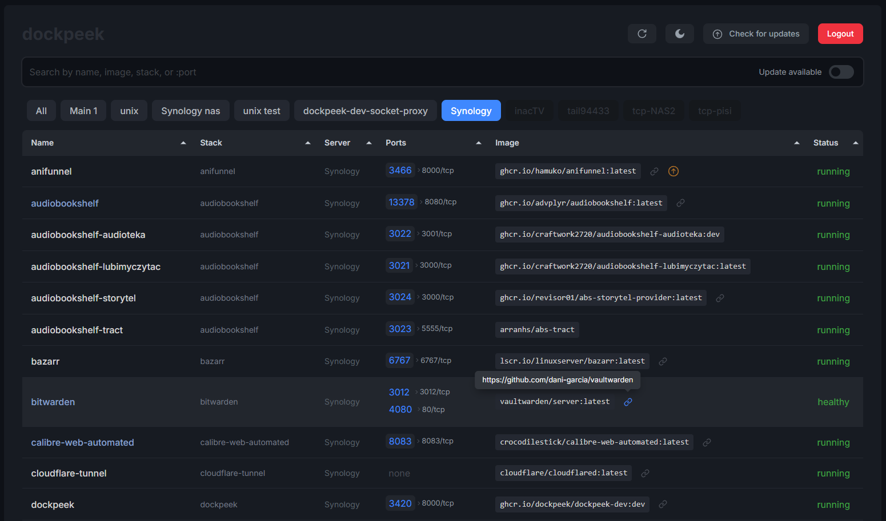

<div align="center">
  <a href="https://github.com/dockpeek/dockpeek">
     
  </a>
</div>

<h1 align="center">Dockpeek</h1>
<h3 align="center">Docker Port Dashboard for Easy Container Access</h3>

<br>
<br>

**Dockpeek** is a lightweight, self-hosted Docker dashboard that allows you to view and access exposed container ports with a clean, click-to-access interface. It supports both local Docker sockets and remote hosts via `socket-proxy`, making it easy to manage multiple Docker environments from a single place. Additionally, Dockpeek includes **image update checking**, so you can easily see if newer versions of your container images are available.


## Key Features

- **Port Mapping Overview** – Quickly see all running containers and their exposed ports.
- **Click-to-Access URLs** – Open containerized web apps instantly with a single click.
- **Multi-Host Support** – Manage multiple Docker hosts and sockets within one dashboard.
- **Zero Configuration** – Automatically detects running containers with no setup required.
- **Image Update Checking** – Monitor available updates for your container images.
- **Custom Labels Support** – Use `dockpeek.https` to force ports to open as HTTPS and `dockpeek.link` to make container names clickable links.


<br>

<div align="center">



</div>

<br>

### Why Use Dockpeek?

Tired of remembering IP addresses and port numbers to access your containerized apps? **Dockpeek** gives you a clean, centralized dashboard with one-click access to any exposed container service—whether it's running locally or remotely.

Perfect when you're dealing with many containers across different machines and need to keep track of which images have updates available. Whether you're a developer, a sysadmin, or just managing your home lab, Dockpeek keeps things simple and organized while ensuring your containers stay current.

<br>

## 🔧 Installation

### Option 1: Direct Socket Access
```yaml
services:
  dockpeek:
    image: ghcr.io/dockpeek/dockpeek:latest
    container_name: dockpeek
    environment:
      - SECRET_KEY=my_secret_key   # Set secret key
      - USERNAME=admin             # Change default username
      - PASSWORD=admin             # Change default password
    ports:
      - "3420:8000"
    volumes:
      - /var/run/docker.sock:/var/run/docker.sock
    restart: unless-stopped
```

<br>

### Option 2: Using `socket-proxy`


```yaml
services:
  dockpeek:
    image: ghcr.io/dockpeek/dockpeek:latest
    container_name: dockpeek
    environment:
      - SECRET_KEY=my_secret_key   # Set secret key
      - USERNAME=admin             # Change default username
      - PASSWORD=admin             # Change default password
      - DOCKER_HOST=tcp://dockpeek-socket-proxy:2375
    ports:
      - "3420:8000"
    depends_on:
      - dockpeek-socket-proxy
    restart: unless-stopped

  dockpeek-socket-proxy:   # socket-proxy for Docker API
    image: lscr.io/linuxserver/socket-proxy:latest
    container_name: dockpeek-socket-proxy
    environment:
      - CONTAINERS=1 
      - IMAGES=1     
      - PING=1       
      - VERSION=1    
      - INFO=1
      - POST=1       # <-- This is needed for "Check for updates" operations
    volumes:
      - /var/run/docker.sock:/var/run/docker.sock:ro
    read_only: true
    tmpfs:
      - /run
    ports:
      - "2375:2375"
    restart: unless-stopped
```

<br>

###  Add Additional Docker Hosts

You can connect and manage multiple Docker instances from a single dashboard.

> [!TIP]
> The easiest way to do this is by installing a Docker Socket Proxy on each Docker host. This exposes the Docker API via an HTTP port (e.g., 2375), allowing secure and controlled remote access to each instance.

```yaml
    environment:
      # Optional: Add extra Docker hosts by setting these variables.

      # Docker Host 1
      - DOCKER_HOST_1_URL=unix:///var/run/docker.sock    # Docker socket URL
      - DOCKER_HOST_1_NAME=MyServer1                     # Name shown in the UI
      - DOCKER_HOST_1_PUBLIC_HOSTNAME=                   # (Optional) public adress; if empty, inferred from URL
      
      # Docker Host 2
      - DOCKER_HOST_2_URL=tcp://192.168.1.168:2375     
      - DOCKER_HOST_2_NAME=Synology                    
      - DOCKER_HOST_2_PUBLIC_HOSTNAME=NAS              
      
      # Add more Docker hosts by increasing the number (3, 4, etc.)

```
  
> [!NOTE]
> `unix:///var/run/docker.sock`   Requires mounting the Docker socket `volumes: /var/run/docker.sock:/var/run/docker.sock`


<br>


## Environment Variables

| Variable                      | Description                                                                 |
|-------------------------------|-----------------------------------------------------------------------------|
| `SECRET_KEY`                  | A strong, unique secret.                                                    |
| `USERNAME`                    | Username for Dockpeek login.                                                |
| `PASSWORD`                    | Password for Dockpeek login.                                                |  
| `DOCKER_HOST`                 | URL of the Docker Socket. Can be: <br>- Local socket: `unix:///var/run/docker.sock` <br>- TCP connection: `tcp://host.docker.internal:2375` or direct IP. |
| `DOCKER_HOST_NAME`            | Name shown in the UI ("local" is default)                                   |
| `DOCKER_HOST_PUBLIC_HOSTNAME` | Public hostname or IP for clickable links (optional)                        |

### Additional Docker Hosts
| Variable                      | Description                                                                 |
|-------------------------------|-----------------------------------------------------------------------------|
| `DOCKER_HOST_N_URL`           | URL for additional Docker hosts (e.g., `tcp://192.168.1.10:2375`). Must be a directly reachable host; `host.docker.internal` does **not** work. `N` is a numeric identifier (1, 2, 3, etc.). |
| `DOCKER_HOST_N_NAME`          | Name shown in the UI                                                        |
| `DOCKER_HOST_N_PUBLIC_HOSTNAME`| Public hostname or IP for clickable links (optional). If unset, inferred from `DOCKER_HOST_N_URL`. |

> [!NOTE]
> - `DOCKER_HOST` supports both local and TCP connections.  
> - Multi-host variables (`DOCKER_HOST_N_*`) require a directly reachable host; `host.docker.internal` cannot be used.  
> - Make sure the `N` indices match for URL, name, and hostname.


<br>


## Labels

Dockpeek supports labels to customize behavior for individual containers. Add these labels in the `labels` section of your `docker-compose.yml`

| Label                        | Description                                                                 |
|-------------------------------|-----------------------------------------------------------------------------|
| `dockpeek.https=PORTS`        | Comma-separated list of ports that should always open as HTTPS. Example: `dockpeek.https=3001,3002`. Must be added to the container exposing these ports. |
| `dockpeek.link=URL`           | Makes the container name a clickable link pointing to the specified URL. Example: `dockpeek.link=https://example.com`. Useful for reverse proxy setups. Must be added to the container. |

### Example in `docker-compose.yml`

```yaml
services:
  myapp:
    image: myapp:latest
    ports:
      - 3001:9000/tcp
      - 3002:9001/tcp
    labels:
      - "dockpeek.https=3001,3002" # Ports 3001 and 3002 will open as HTTPS
      - "dockpeek.link=https://example.com" # Container name becomes a clickable link to this URL
```

<br>

## FAQ

**Q: Can I search for containers by exposed port only?**

 Yes. Dockpeek supports searching using `:port`.

> For example, typing `:8080` will show all containers exposing port `8080`.

<br>

**Q: How does Dockpeek know when to use HTTPS instead of HTTP?**

 Dockpeek automatically treats the following as HTTPS:

* Container port `443/tcp`
* Any exposed port ending with `443` (e.g., `8443`, `9443`)
* Any ports specified via label `dockpeek.https` (e.g., `dockpeek.https=3001,3002`).  
 > Make sure to add the `dockpeek.https` label in the `labels` section of the container in `docker-compose.yml` where these ports are exposed.  
```yaml
    labels:
      - "dockpeek.https=3001,3002"
```

<br>

**Q: Can I make a container name a clickable link?**

Yes, using the new label:

* `dockpeek.link=https://example.com` – the container name becomes a clickable link to the specified URL.  
  > This is especially useful if you use a reverse proxy and want to open your application via its public address.  
```yaml
    labels:
      - "dockpeek.link=https://example.com"
```